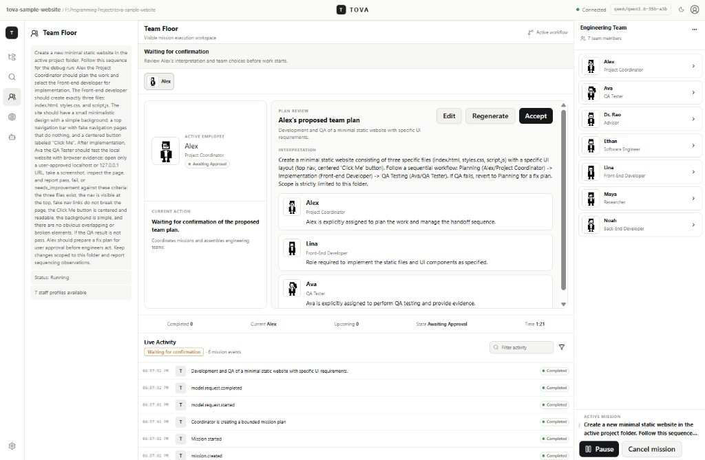
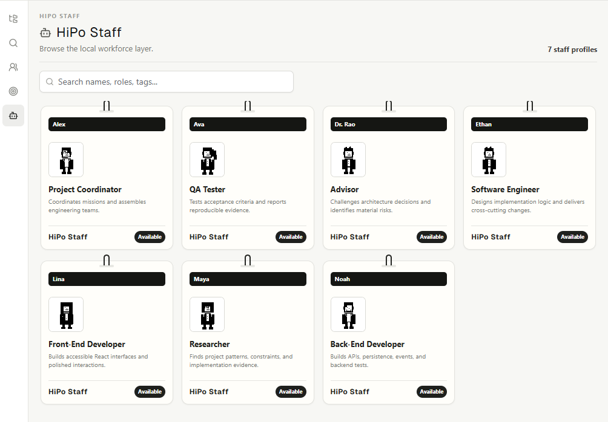
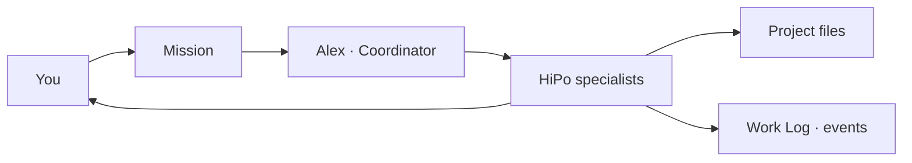
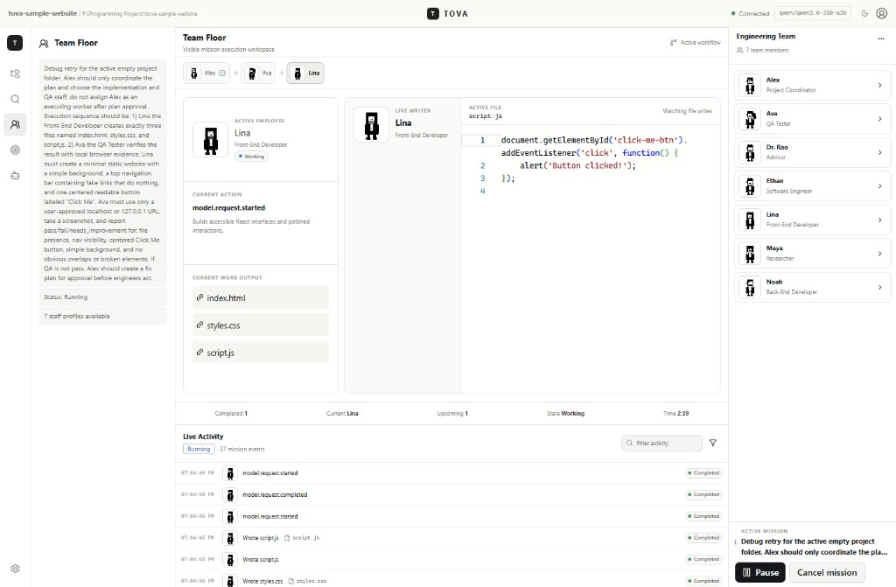
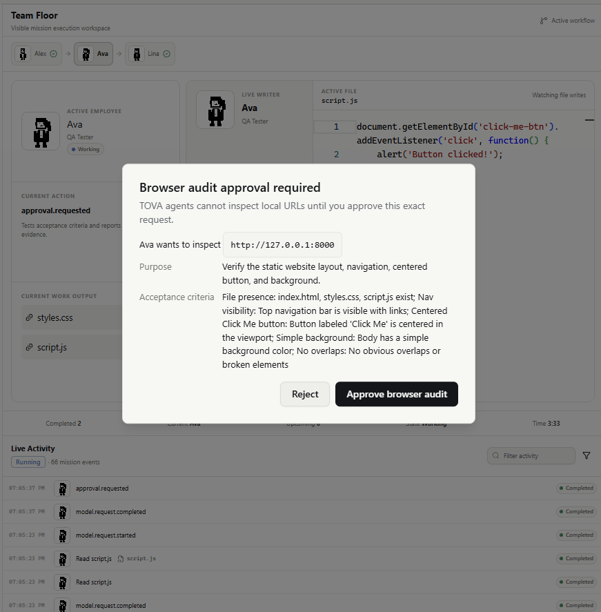
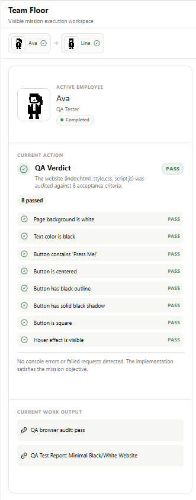
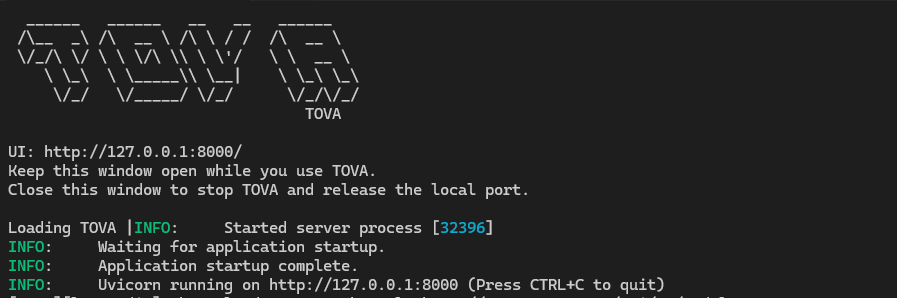
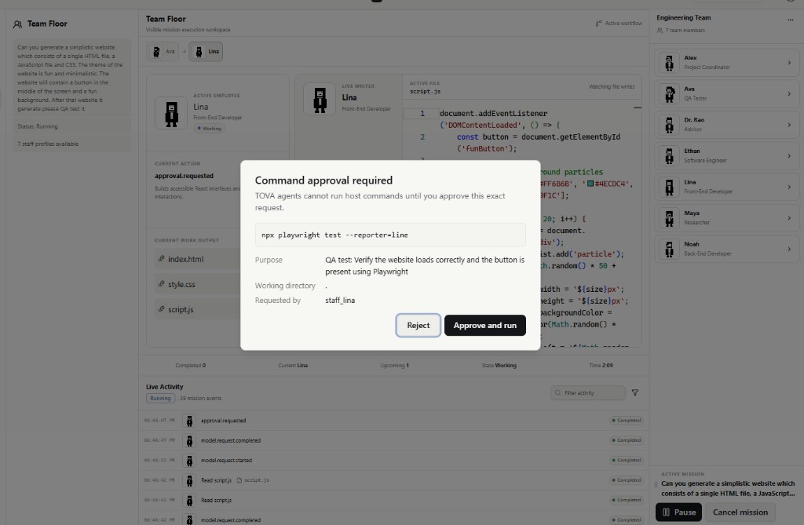

<div align="center">

```text
  ______   ______   __   __   ______
 /\__  _\ /\  __ \ /\ \ / /  /\  __ \
 \/_/\ \/ \ \ \/\ \\ \ \'/   \ \  __ \
    \ \_\  \ \_____\\ \__|    \ \_\ \_\
     \/_/   \/_____/ \/_/      \/_/\/_/
                                 TOVA
```

# TOVA

**Team-Orchestrated Visual Agents**

> Taking your local LLM code to the next level.

A local-first development environment for people who run their own models
and want a full software team on the other side of the prompt — not one
generic chat.

[](LICENSE)
[](#quick-start)
[](#quick-start)
[](#windows-package)

</div>

TOVA is for local AI developers who already invested in VRAM, LM Studio, and
strong open models — and still feel like they are leaving capacity on the
table. One overloaded assistant burns context on the wrong work. A **HiPo-Staff**
team (High-Power Staff) splits the job the way a real shop would: a manager
scopes the mission, then calls the right specialists for research, implementation,
review, and QA.

You keep the model. TOVA gives it a roster, a floor, and a chain of command.

Created by **Amado Lazo**. If TOVA helps you ship, a coffee keeps the lights on.

[](https://www.linkedin.com/in/amado-lazo/)
[](https://amadolazo.com/)

<p>
  <a href="https://www.buymeacoffee.com/amadolazo">
    
  </a>
</p>

## Why a team beats one chat

A local model is only as useful as the role you put it in. TOVA does not hide
the work in a private chain of thought. It runs **missions**: bounded software
jobs where named staff take actions, touch files, request approvals, and leave
an inspectable Work Log.

| One generic assistant | TOVA HiPo-Staff |
| --- | --- |
| Same persona for planning, coding, and testing | A coordinator plus specialists with distinct tools and rules |
| Context filled with mixed, leftover intent | Each staff member is called for a bounded slice of the mission |
| Output you have to trust | Events, files, decisions, tests, and approvals you can audit |
| Cloud by default | LM Studio on `127.0.0.1` — the model never has to leave the machine |

Alex (Project Coordinator) reads the request, assembles who is needed, and
hands work to Maya, Ethan, Lina, Noah, Ava, or Dr. Rao. You approve plans and
commands. The Team Floor shows who is active. Pause, resume, or cancel between
steps.



## Build any HiPo team you can define

The shipping roster is a software-engineering company. That is a starting
shape, not a ceiling.

HiPo-Staff members are Markdown profiles. Add people, change their operating
instructions, and point a manager at them. The coordinator calls whoever is
on the roster for complex work. That is how you stand up:

- **Web development** — researcher, front-end, back-end, QA
- **Application / product** — engineer, advisor, tester, coordinator
- **Cybersecurity** — threat analyst, reviewer, incident lead, called by a
  security manager
- **Whatever the mission needs** — if you can write the role, TOVA can seat it

Create a new `.md` file under [`HiPo-Staff/staff/`](HiPo-Staff/staff/), follow
[`docs/STAFF_PROFILE_SPEC.md`](docs/STAFF_PROFILE_SPEC.md), and add the role to
the manager's `handoff_targets`. Edit existing staff from **HiPo Staff** in the
app, or in the Markdown itself. Profiles are the source of truth.

```yaml
---
id: staff_alex
employee_id: TOVA-001
slug: alex-project-coordinator
name: Alex Morgan
display_name: Alex
role: Project Coordinator
role_key: project_coordinator
model_profile: coordinator-default
tools:
  - repository.read
  - mission.plan
permissions:
  filesystem_read: true
  filesystem_write: false
can_delegate: true
handoff_targets:
  - researcher
  - software_engineer
  - frontend_developer
  - backend_developer
  - qa_tester
  - advisor
---
```

## Default engineering roster

| Staff | Role | Called for |
| --- | --- | --- |
| **Alex Morgan** | Project Coordinator | Scope, plan, assemble the team, close the mission |
| **Maya Chen** | Researcher | Patterns, constraints, evidence in the repo |
| **Ethan Brooks** | Software Engineer | Cross-cutting design and implementation |
| **Lina Ortiz** | Front-End Developer | Interface, accessibility, client behavior |
| **Noah Williams** | Back-End Developer | APIs, persistence, events, backend tests |
| **Ava Patel** | QA Tester | Acceptance criteria, tests, reproducible evidence |
| **Dr. Priya Rao** | Advisor | Architecture challenges and material risk |





## Team Floor

The Team Floor is the mission workspace. Staff appear in sequence, write files
in the live editor, and leave a Work Log you can inspect.



Staff cannot hit a local URL or run a host command until you approve that
exact request.



When QA finishes, the verdict is itemized — pass or fail against the mission's
acceptance criteria, with artifacts you can open.



## Quick start

LM Studio is **not** bundled. Install it, start **Local Server**, and load a
model before you send a mission.

Suggested models (tested by Amado Lazo on an **RTX 4060 Ti 16GB**):

- **qwen3.6-35b-a3b**
- **qwen-3.5-27b**
- **Qwen3.8-27B**

Those three run extremely well in TOVA on that card. Other local models can
work; these are the ones actually proven on this hardware.

### Windows app

1. Build the installer (see [Windows package](#windows-package)) or run a
   `TOVA-Setup.exe` you already have.
2. Start **TOVA** from the Start Menu. A command window opens with the TOVA
   banner, a loading line, then LM Studio status. The app serves the UI at
   `http://127.0.0.1:8000/` and opens that address in your browser.

   

3. Keep the command window open while you work. Closing it stops TOVA and
   frees the port.
4. In LM Studio, start Local Server and load a model (default
   `http://127.0.0.1:1234/v1`). Prefer **qwen3.6-35b-a3b**, **qwen-3.5-27b**,
   or **Qwen3.8-27B** if you have about 16GB VRAM.
5. When TOVA shows **Connected**, send the canned first mission with
   **Send to Team**.
6. Accept Alex's plan. Approve commands or browser audits when asked.

If no browser window appears, open `http://127.0.0.1:8000/` yourself. Set
`TOVA_OPEN_BROWSER=0` to disable auto-open.

Use **Advanced** in the model dialog only for a non-default local server URL.
Public model-server hosts stay disabled unless you explicitly enable them.

### From source

Contributor machines need Node.js 20.19+, pnpm 11.17+, Python 3.12+, and uv 0.11+.

```bash
pnpm install
uv sync --directory apps/api
pnpm dev
```

The browser opens `http://127.0.0.1:5173` against the API on port 8000. On a
clean machine with no recent projects, TOVA opens the bundled first-mission
sample. Connect LM Studio, then click **Send to Team**.

Or use two terminals:

```bash
pnpm dev:web
pnpm dev:api
```

Copy [`.env.example`](.env.example) to `.env` if you want a pinned model:

```text
TOVA_LM_STUDIO_BASE_URL=http://127.0.0.1:1234/v1
TOVA_LM_STUDIO_MODEL=qwen/qwen3.6-35b-a3b
TOVA_LM_STUDIO_API_TOKEN=
```

Runtime status is exactly **Unconfigured**, **Connected**, or **Unavailable**.
A selected, reachable model is required before a mission is created and is
checked again before execution starts.

## What you get in the product

- Compact editor shell: real path-based explorer, Monaco, tabs, status bar
- Named HiPo-Staff with pixel avatars, Work Logs, and a live Team Floor
- LM Studio discovery, model selection, connection testing, mission execution
- Event-derived progress — not a hidden transcript
- Pause, resume, cancel (pause takes effect between agent steps)
- Last project and mission restore after you quit and relaunch
- Command approvals, bounded command execution, project-root filesystem containment

## Windows package

Build the one-process Windows app (UI + API on `127.0.0.1:8000`; LM Studio
stays external):

```powershell
powershell -ExecutionPolicy Bypass -File packaging/windows/build.ps1
```

That produces `dist/windows/tova.exe` and, if Inno Setup 6 is installed,
`dist/windows/TOVA-Setup.exe`. Binaries are local build artifacts and are not
committed.

Or run the production server from source after `pnpm --filter @tova/web build`:

```bash
uv run --directory apps/api python -m app
```

Then open `http://127.0.0.1:8000`.

## Architecture

TOVA is a pnpm and uv monorepo. The React/Vite client uses TanStack Query for
server-owned state, Zustand for ephemeral UI state, and pure event reducers
for mission and Work Log projections. FastAPI appends versioned events to disk
**before** broadcasting them over WebSockets. Missions talk to the selected
LM Studio model through an OpenAI-compatible provider boundary.

```text
apps/
├── api/     FastAPI · missions, staff, events, tools
└── web/     React · Team Floor, editor, Work Log
HiPo-Staff/  Markdown source of truth for employees
```

Deeper docs:

- [`docs/PRODUCT_SPEC.md`](docs/PRODUCT_SPEC.md)
- [`docs/ARCHITECTURE.md`](docs/ARCHITECTURE.md)
- [`docs/EVENT_PROTOCOL.md`](docs/EVENT_PROTOCOL.md)
- [`docs/STAFF_PROFILE_SPEC.md`](docs/STAFF_PROFILE_SPEC.md)
- [`docs/SECURITY.md`](docs/SECURITY.md)
- [`docs/DIAGNOSTICS.md`](docs/DIAGNOSTICS.md)
- [`docs/RELEASE_NOTES.md`](docs/RELEASE_NOTES.md)

## Security boundary

TOVA is not an arbitrary-code sandbox. Projects stay under configured roots
when `TOVA_ALLOWED_PROJECT_ROOTS` is set. Repository tools reject absolute
paths, traversal, excluded directories, credential files, and project-root
escapes. Every command needs an explicit approval, runs without stdin in a
project-contained working directory, gets a sanitized environment, and has
timeout and output limits. Provider credentials stay server-side and never
appear in activity events.



## Honest limits

- LM Studio must be installed and running separately. TOVA does not ship a model.
- Pause and cancel do not abort an in-flight LM Studio HTTP request. Cancel
  still ends the mission and stops further iterations.
- There is no OS network jail. Commands are allowlisted, approved, and
  project-root contained.
- Packaged browser audit uses a static page check when Node and Playwright
  are not installed. That checks served HTML against acceptance criteria; it
  does not click the live DOM.
- Mission state is local to this process plus the on-disk event store.

## Verify

```bash
pnpm verify
uv run --directory apps/api pytest
uv run --directory apps/api ruff check .
uv run --directory apps/api mypy app
```

Playwright browsers, if needed:

```bash
pnpm --filter @tova/web exec playwright install chromium
```

## Contributing

Read the nearest `AGENTS.md`. Preserve event compatibility. Write failing
tests before implementation. Keep components focused. Include fresh
verification evidence. Do not add hidden-reasoning displays or weaken the
default-deny tool boundary.

By submitting a contribution, you certify that you have the right to
submit it (see the [Developer Certificate of Origin](https://developercertificate.org/))
and you license your work to the project under the GNU Affero General
Public License v3.0. You do not transfer the TOVA or HiPo-Staff marks.

## Buy me a coffee

TOVA is free and local-first. If it helps you get more out of your own models,
you can support the work here:

<p>
  <a href="https://www.buymeacoffee.com/amadolazo">
    
  </a>
</p>

https://www.buymeacoffee.com/amadolazo

## Star history

[](https://www.star-history.com/#alilazo/TOVA&Date)

## License and marks

Copyright (c) 2026 **Amado Lazo**. Created by Amado Lazo.

TOVA is free software under the [GNU Affero General Public License v3.0](LICENSE).
You may run it, study it, and share it. If you distribute TOVA or run a
modified version as a network service, you must provide the complete
corresponding source under the same license. Proprietary closed-source
copies are not allowed.

The AGPL licenses the **code**. It does not license the names **TOVA** or
**HiPo-Staff**. Forks must use a different product name. See
[NOTICE](NOTICE), [TRADEMARKS.md](TRADEMARKS.md), and
[CITATION.cff](CITATION.cff).
